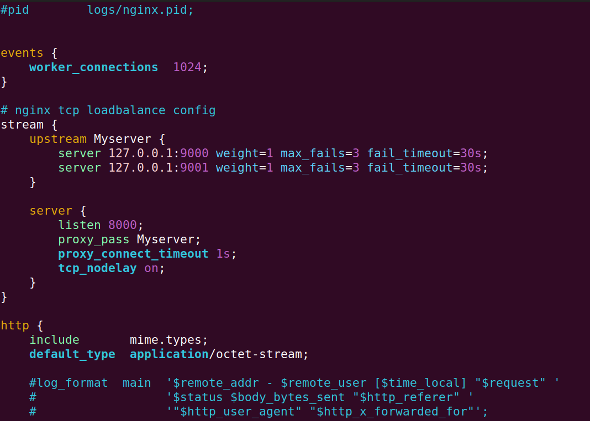

# ChatServer
基于muduo网络库的集群聊天服务器，NginxTCP负载均衡以及Redis中间件跨服务器通信，JSON序列化与反序列化消息作为通信协议

## 开发环境
- Linux kernel version 6.2.0-34-generic
- Ubuntu 22.04
- cmake version 3.22.1
- [muduo](https://github.com/chenshuo/muduo)
- MySQL 8.0.35
- nginx 1.24.0
- [hiredis](https://github.com/redis/hiredis)

## 自动编译
执行`./build.sh`即可自动编译，生成的可执行文件`ChatServer`、`ChatClient`在`bin`目录中

执行`./chatServer.sql`自动生成MySQL库表

## MySQL表
user表
|字段名称|字段类型|字段说明|约束|
|------|------|------|------|
|id|INT|用户id|PRIMARY KEY、AUTO_INCREMENT|
|name|VARCHAR(50)|用户名|NOT NULL, UNIQUE|
|password|VARCHAR(50)|用户密码|NOT NULL|
|state|ENUM('online', 'offline')|当前登录状态|DEFAULT 'offline'|

friend表
|字段名称|字段类型|字段说明|约束|
|------|------|------|------|
|userid|INT|用户id|NOT NULL、联合主键|
|friendid|INT|好友id|NOT NULL、联合主键|

allgroup表
|字段名称|字段类型|字段说明|约束|
|------|------|------|------|
|id|INT|群id|PRIMARY KEY、AUTO_INCREMENT|
|groupname|VARCHAR(50)|群名称|NOT NULL, UNIQUE|
|groupdesc|VARCHAR(200)|组功能描述|DEFAULT ''|

groupuser表
|字段名称|字段类型|字段说明|约束|
|------|------|------|------|
|groupid|INT|群id|NOT NULL、联合主键|
|userid|INT|群员id|NOT NULL、联合主键|
|grouprole|ENUM('creator', 'normal')|群内角色|DEFAULT 'normal'|

offlinemessage表
|字段名称|字段类型|字段说明|约束|
|------|------|------|------|
|userid|INT|用户id|NOT NULL|
|message|VARCHAR(500)|离线消息(存储json字符串)|NOT NULL|

## Nginx配置TCP负载均衡
1. nginx源代码编译时加入`--with-stream`参数激活TCP负载均衡模块，默认安装在`/usr/local/nginx`，可执行文件在`sbin`目录里面，配置文件在`conf`目录里面
2. `vim /usr/local/nginx/conf/nginx.conf`添加TCP负载均衡及服务器信息

stream为TCP负载均衡器listen 8000端口

## 基于发布-订阅redis消息队列进行跨服务器通信

